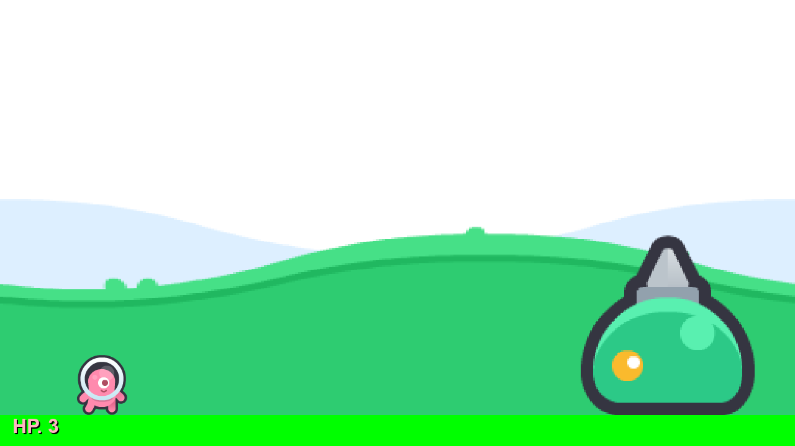

# Cuphead Kenney Edition

A boss-battle platformer inspired by Cuphead, built using Python, Pygame, and Kenney assets.



## Features

- **Dynamic Player Mechanics**:
    - **8-Way Shooting**: Aim in any direction using arrow keys while shooting.
    - **Dashing**: Quick horizontal dash with invincibility frames for dodging attacks.
    - **Health System**: 3 HP with visual flashing feedback and invulnerability frames after taking damage.
- **Multiphase Boss Battle**:
    - **Three Unique Phases**: The boss transitions through Intro, Phase 1, and Phase 2, each with increasing difficulty and different movement patterns.
    - **Dynamic AI**: Sinusoidal movement, jumping patterns, and top-screen strafing.
    - **Projectiles**: Dodge targeted red projectiles from the boss.
- **Visuals & UI**:
    - **Kenney Asset Integration**: High-quality 2D sprites for players, bosses, and background.
    - **Stylized HUD**: Progress bar on the death screen showing how close you were to winning.
    - **Game States**: "KNOCKOUT!" victory screen and "YOU DIED" retry screen.
- **Audio**:
    - **1930s Jazz Battle Theme**: Atmospheric battle music ("San Sue Strut" by Casa Loma Orchestra) that loops during gameplay and stops on game end.

## Controls

| Action | Key |
| :--- | :--- |
| **Move / Aim** | Arrow Keys |
| **Jump** | `Space` |
| **Shoot** | `X` |
| **Dash** | `C` |
| **Restart** | `R` (on Game Over / Win) |

## Installation

1.  **Clone the repository** (or download the source).
2.  **Ensure Python 3 and Pygame are installed**:
    ```bash
    pip install pygame
    ```
3.  **Run the game**:
    ```bash
    python3 main.py
    ```

## Project Structure

- `main.py`: Entry point and game loop logic.
- `player.py`: Player movement, shooting, and dash mechanics.
- `boss.py`: Boss AI and phase management.
- `bullets.py`: Projectile logic for both player and boss.
- `sprite_loader.py`: Utility for loading and scaling Kenney assets.
- `settings.py`: Global constants and configurations.
- `music/`: (Optional) Directory for game audio tracks.

## Recent Updates (Walkthrough Summary)

- Successfully integrated the battle music system.
- Refined the HP display to be more consistent with the game's aesthetic.
- Implemented the boss's transition through three distinct phases.
- Added the stylized death screen with progress tracking.

---
*Created as part of a coding assistant session.*

## Credits

- **Assets**: [Kenney Platformer Pack](https://kenney.nl/assets/platformer-pack) by [Kenney](https://kenney.nl) (License: [CC0 1.0 Universal](https://creativecommons.org/publicdomain/zero/1.0/))
- **Inspiration**: MDHR Studio (Cuphead)

